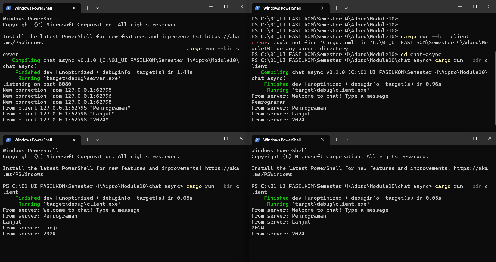
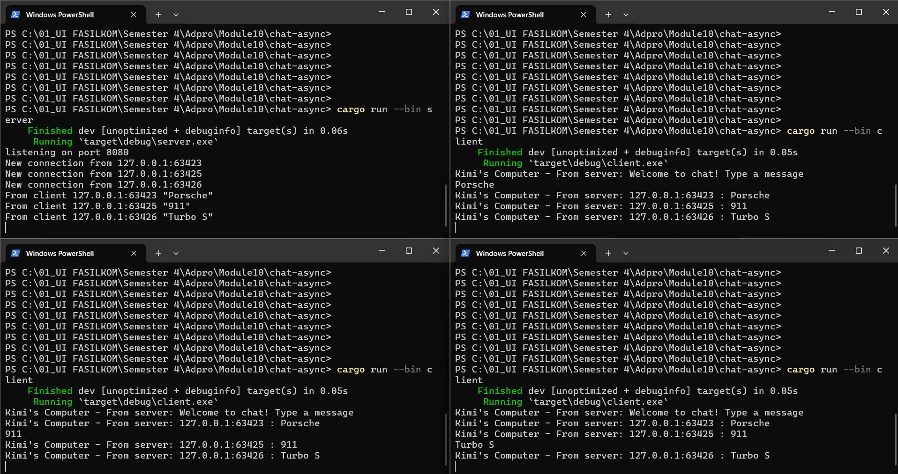

# Reflection
## Original Code of Broadcast Chat 

 
Untuk menjalankan program sesuai dengan ketentuan soal (1 server dan 3 client), saya membuka 4 windows terminal dan menjalankan perintah `cargo run --bin server` pada satu terminal dan menjalankan perintah `cargo run --bin client` pada 3 terminal lainnya. Ketika saya mengetik suatu teks pada client, maka server akan menerima pesan tersebut dan di-broadcast ke semua client (termasuk client pengirim pesan tersebut). Proses yang sama juga terjadi ketika client lain mengirimkan teks ke server.
## Modifying the Websocket Port 

 
Perlu dilakukan modifikasi pada kedua file client.rs dan server.rs untuk mengganti port menjadi 8080. Pada file client.rs, port diganti pada Uri di `ClientBuilder`, yang merupakan builder untuk koneksi WebSocket pada client. Pada file server.rs, port diganti pada variabel `listener` yang bertujuan sebagai TCP listener pada koneksi serta pada perintah print yang menunjukkan kalau server listening pada port 8080. Program tetap berjalan layaknya sebelum port diganti.
## Small changes, add IP and Port 

 
Untuk bisa menambahkan informasi berupa IP dan port dari sender pada setiap client, saya mengubah format teks broadcast pada file server.rs dengan menambahkan address `addr` dari client sender, dari yang sebelumnya `bcast_tx.send(text.into())?;` menjadi `bcast_tx.send(format!("{addr} : {text}"))?;`